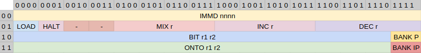

This is an emulator for a fantasy CPU architecture.

The primary goal of the design was to make something which feels very different to traditional designs,
but without feeling intentionally obtuse or full of special cases (at least any more so than other architectures).

It is difficult to write programs in, but this is mostly due to it mimicing very early 8-bit architectures
with restrictions on memory etc.

## Basics

The CPU is an 8-bit architecture. All instructions are exactly one byte long, and take one cycle to execute.

It has 64KiB of writable memory, which contains both code and data.
Memory is banked into 256 banks of 256 bytes each,
ie. every memory address has an upper byte which is a bank number
and a lower byte which is the address within the bank.
Code and data accesses have independent bank selectors.

The CPU has the following registers (8 bits unless noted):
* `A` - General accumulator register.
* `P` - Address register. Instructions can read/write to the memory pointed to by `P`.
* `PB` - Bank of P. Determines which address bank acceses using `P` will use.
* `IP` - The instruction pointer. When read, it contains the address of the current instruction.
  When written to, it indicates the address of the next instruction to execute.
  If not written to otherwise, is incremented by 1 each cycle.
* `IB` - Instruction Bank. Determines which address bank instructions will be read from.
* `I` - The immediate register. Each cycle, the contents of this register are shifted left 4 bits.
  You can write to the bottom 4 bits of `I` using the `IMMD` instruction, and the `I` register has
  various effects on instructions. It acts as a kind of extension to provide immediate values to instructions.
* `CF` (1 bit) - The condition flag. This can be set by instructions depending on their results.
  Each instruction indicates whether it should run if the condition flag is set or unset.

At the start of execution, all registers are set to zero.
This means the first instruction executed is at `0:0`.

Note that the IP value wraps around by default. So the next instruction after `0:ff` is `0:0`, not `1:0`.

## Instructions

All instructions are encoded in 8 bits, from most signifigant to least signifigant:
* Bit 0: Must match the CF flag or else this instruction is a no-op. ie. If this is 0, then the
  instruction is only run if the CF flag is unset. If this is 1, the instruction is only run if the CF
  flag is set. It is not possible to have an instruction run for both cases, though you could repeat
  the instruction twice with just this bit flipped.
* Bit 1: If set, this instruction's result will affect the CF flag. Otherwise the CF flag will
  always remain unchanged.
* Bits 2-6: Encodes the instructions as follows:



For instructions that take a register, the register is encoded in two bits as follows:
- `00` -> `A`
- `01` -> `IP`
- `10` -> `P`
- `11` -> `[P]`, ie. the memory at address `P`

For instructions that take two registers, the first one listed is encoded in the higher bits.
So for example `onto A [P]` would be encoded as:
```
onto  A  [P]
  11  00 11
```

### IMMD nnnn

Load immediate value. Sets the bottom 4 bits of the `I` register to the bottom 4 bits of the instruction.

This is generally used to pre-load the immediate register with the desired value for another instruction,
eg.
```
immd 5 ; I = 0x05
immd 9 ; I = 0x59
; do something with I = 0x59
```

Note that `immd 0` (which is encoded as `0b00000`) is effectively a no-op.

If bit 1 of the instruction is set, the condition flag is cleared.

### ONTO r1 r2

Adds `r2` onto `r1`. Sets r1 to the result of `r1 + r2 + I`. Examples:
```
onto A A ; double A

onto A [P] ; adds the value in memory at P to A

immd 1
onto IP A ; jumps forward A+1 instructions - useful for jump tables.
```

`onto [P] [P]` is disallowed.

On overflow, the result value is wrapped.
If bit 1 of the instruction is set, the condition flag indicates whether the operation overflowed.

### BIT r1 r2

Performs a bitwise operation between r1 and r2. The details of the bitwise operation are determined
by the `I` register.

For each bit in `r1` and `r2`, a value is calculated by concatenating the two bits.
eg. if the first bit of `r1` is 1 and the first bit of `r2` is `0`, the concatenated value is `10`,
ie. `2`. Let's call that value `n`. The value of the same bit in the result is then the nth bit of `I`,
counting upwards from the least-signifigant bit.

So continuing our example of `n` being 2, if the bottom 4 bits of `I` were `1000`, then the result
bit would be 0:
```
I=1000
   ^
  3210
```

This lets you specify the standard bitwise operations based on the value of `I`.
For example, `1110` means a bitwise `OR` operation, as the result will be 1 unless both bits are `0`
(ie. n = 0).

Here are some more examples:
- `I=1000`: AND
- `I=0110`: XOR
- `I=0111`: NAND
- `I=0001`: NOR

Note that it's possible for the lookup table to only depend on one register or the other,
for example `I=0011` will result in the bitwise NOT of `r1`, since `r2`'s value doesn't change the result.

If `I=0000`, then the result will always be `0` (this is a convenient way to set a register to `0`).

`bit [P] [P]` is disallowed.

If bit 1 of the instruction is set, the condition flag is set as follows.

Given the top 4 bits of `I` are `fbbb`, then bit number `bbb` of the result is compared to `f`.
If they match, CF is set. Otherwise it is unset. So for example if the top 4 bits of `I` are
`1010`, it checks if the second bit of the result (counting from 0, least-signifigant first) is `1`.

This allows you to test for specific bits. For example, if you have a bitflags field in [P]
and a mask in A, you could do `[P] & A` and check if the 5th bit is set all in one instruction
(plus setting up the immediate value):
```
immd 0b1101 ; 1 = is set, 101 = 5th bit
immd 0b1000 ; AND operation
!bit [P] A ; leading ! indicates CF should be written to
```

### INC r / DEC r

Increment or decrement `r` by `I`. Sets `r` to `r + I` (for `INC`) or `r - I` (for `DEC`).

If bit 1 of the instruction is set, the condition flag indicates whether the operation overflowed / underflowed.

### MIX r

Rearrange bits of `r`, according to `I`.

`r` is sliced into 4 pairs of bits, ie. `aabbccdd`.
Each corresponding pair of bits in `I` acts as a 2-bit number `n`. Those two bits of the result
are set to the nth pair of bits in `r`.

For example, suppose `r = 00001111` and `I=01001110`.

The pairs in `r` are:
```
pair  3  2  1  0
value 00 00 11 11
```

The top two bits of `I` are `01`, so the top two bits of the result are pair 1 in `r`
which is `11`. The next two bits of `I` are `00` so we use pair 0 which is `11`.
The next two bits of `I` are `11` so we use pair 3 which is `00`, and finally the last two bits
of `I` are `10` so we use pair 2 which is `00`:

```
      I 01 00 11 10
pair r
   0 11    11
   1 11 11
   2 00          00
   3 00       00
 result 11 11 00 00
```

So `I=00011011` means "swap the top 4 bits with the bottom 4 bits".

Some examples of other operations:
* `I=10010011`: Rotate left by 2 bits
* `I=00111001`: Rotate right by 2 bits
* `I=00000000`: Copy the bottom 2 bits to all pairs of bits

If bit 1 of the instruction is set, the condition flag indicates whether any bits are set in the result, ie. it's non-zero.

For example, `!mix A` (where `I=0`) will set the condition flag to `A % 4 != 0`.

# BANK P / BANK IP

Sets the `P` bank or the `IP` bank to `I`.

If bit 1 of the instruction is set, clears the condition flag.

Note that switching IP bank does not affect the IP register itself,
and execution will continue at the next address but in the new bank.

### LOAD

Sets `I` to `A`. This is the only way to load a register's value into `I`, instead of it being hard-coded.

If bit 1 of the instruction is set, inverts the condition flag.

### HALT

Halts execution.

### Reserved instructions

Opcodes 010001 and 010010 are reserved for future use and have unspecified behaviour.

## Example programs

### Sum

This sums values 1 to 10, then halts.

In this syntax, a `-` prefix (or no prefix) means to run if CF is unset,
and a `+` prefix means to run if CF is set.
A `!` prefix means bit 1 is set, so CF will be modified.

```
immd 10
inc P ; P = 10
immd 0 ; start of loop. wait for prev immd to clear
onto A P ; A += P
immd 1
!dec P ; P -= 1, set cond on underflow
-immd 5
-dec IP ; ip -= 5, returning to start of loop
+halt
```

### IP Bank switching

In this syntax, a line like `BANK:ADDR:` indicates the following instructions should be placed
at that bank and address.

This program sets up a reusable "far call" routine in the first 4 bytes of banks 1 and 2,
then creates an infinite loop of jumping between them.

```
; On startup, jump to 1:12.
immd 8
inc IP ; IP += 8, ie. jump to 0:10
0:10:
immd 1 ; I = 1
bank IP ; IP bank = I
; since IP = 12 after the bank IP line, this jumps to 1:12.

1:0:
; set up so that when jumping to address 0, we load the target bank from A and switch to it.
load ; I = A
bank IP ; IP bank = I
; This is 1:2, which is where code arriving from another bank will land
immd 0b1010 ; I = 1010, which corresponds to "result = copy of B" in the BIT instruction
bit IP P ; IP = P, ie. jump to P.

1:12:
; Set A = 2 and P = 8, then jump to 0 to initiate bank switch and jump to 2:8
bit A A ; bottom 4 bits of I are 0, so this is A = 0
immd 2
inc A ; A += 2
bit P P ; P = 0
immd 8
inc P ; P += 8
bit IP IP ; IP = 0, jump to 1:0

2:0:
; Identical to first part of bank 1
load
bank IP
immd 0b1010
bit IP P

2:8:
; Set A = 1 and P = 12, then jump to 0 to initiate bank switch and jump to 1:12
bit A A
immd 1
inc A ; A = 1
bit P P
immd 12
inc P ; P = 12
bit IP IP ; IP = 0, jump to 2:0
```
